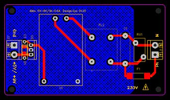
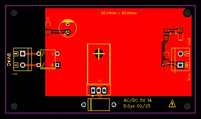

# Alimentations AC/DC — 5V & 9V DC / 5W

**Deux cartes d'alimentation compactes pour ESP32 et modules CYD**  
Projet open-source — [Papy Makers](https://github.com/papymakers)

---

## Présentation

Ce repo regroupe deux cartes d'alimentation aux topologies différentes,
toutes deux compatibles avec les modules **ESP32-2432S028R (CYD)**,
**ESP32-C6** et périphériques 5V ou 9V.

| | [Carte A — Hi-Link 230VAC](#carte-a--hi-link-230vac) | [Carte B — Transfo 9VAC](#carte-b--transformateur-9vac--lm7805) |
|---|---|---|
| Entrée | 230 VAC direct | 9 VAC (transformateur externe) |
| Sortie | 5V/1A ou 9V/0.6A | 5V / 1A |
| Dimensions | 85 × 48 mm | 85.34 × 48.28 mm |
| Isolation | Intégrée (module Hi-Link) | Dans le transformateur externe |
| Régulation | Switching (Hi-Link) ± post-linéaire | Linéaire (LM7805) |
| Ondulation sortie | < 100 mVpp | < 10 mVpp (1000µF + LM7805) |
| Dissipation thermique | Faible | Zone cuivre nu sous LM7805 |

---

## Carte A — Hi-Link 230VAC



PCB universel compatible **HLK-5M05** (5V/1A) et **HLK-9M05** (9V/0.6A),
avec protections EMI et surtensions conformes aux recommandations Hi-Link.

### Configurations disponibles

| Config | Module HLK | U2 | Sortie |
|---|---|---|---|
| **A1** | HLK-5M05 | Pont + C100nF | 5V / 1A |
| **A2** | HLK-9M05 | Pont + C100nF | 9V / 0.6A |
| **A3** | HLK-9M05 | LM7805 + 1N4001 + C100nF | 5V régulé |

### Schéma fonctionnel

```
L ──[F1 2A]──[FL2 CMC 10mH]──┬──► AC-L HLK ──[+V]──[1N4001]──[U2 TO220]──► +V bornier
                              │                               [C 100nF]
N ────────────────────────────┼──► AC-N HLK                             ──► GND bornier
              [RV1 275V]  [Cy 0.1µF/275V]
```

### Composants primaire

| Réf. | Composant | Valeur |
|---|---|---|
| F1 | Fusible temporisé | 2A T — 5×20mm |
| FL2 | Common Mode Choke | 10mH / 1.1A / 250VAC |
| RV1 | Varistance MOV | 275VAC / 7mm |
| Cy | Condensateur sécurité Y | 0.1µF / 275VAC MPP |
| U1 | Module Hi-Link | HLK-5M05 ou HLK-9M05 |

> ⚠️ **230V CA — habilitation électrique requise (NF C 18-510)**

Fichiers PCB : [`hardware/pcb_hilink/`](hardware/pcb_hilink/)

---

## Carte B — Transformateur 9VAC + LM7805



Alimentation linéaire classique : **9VAC → pont de diodes → filtrage → LM7805 → 5VDC**.
L'isolation galvanique est assurée par le transformateur externe.

Zone de **cuivre nu exposé** sous le LM7805 pour dissipation thermique intégrée,
avec trou de fixation M3 pour visser le TO220 sur le PCB.

### Schéma fonctionnel

```
9VAC ──[Bornier J2]──[Pont diodes]──[+]──[C1 1000µF]──[IN LM7805 OUT]──► +5V bornier
                                    [−]─────────────────[GND LM7805   ]──► GND bornier
                                                         [Zone cuivre nu
                                                          + vis M3 TO220]
```

### Composants

| Réf. | Composant | Valeur | Remarque |
|---|---|---|---|
| BR1 | Pont de diodes | 1A / 50V | ou 4× 1N4001 |
| C1 | Électrochimique | 1000µF / 25V | 470µF minimum |
| U1 | Régulateur TO220 | LM7805 | Vis M3 sur PCB |
| J1 | Bornier sortie DC | 2 pos. / 5.08mm | +5V / GND |
| J2 | Bornier entrée AC | 2 pos. / 5.08mm | 9VAC |

### Calcul condensateur de filtrage

```
À 1A, f=100Hz (double alternance), ΔV=1V :
C = I × t / ΔV = 1 × 0.01 / 1 = 1000µF  ← valeur retenue
Tension crête : 9 × √2 = 12.7V  →  choisir 1000µF / 25V minimum
```

### Dissipation LM7805

```
P = (Vin_min - 5) × I = (12.7 - 1.5 - 5) × 1 = 6.2W max
→ Zone cuivre nu obligatoire, vis M3 de fixation recommandée
→ Courant continu recommandé : ≤ 700mA sans radiateur additionnel
```

Fichiers PCB : [`hardware/pcb_transformer/`](hardware/pcb_transformer/)

---

## Applications testées

| Application | Carte | Consommation typique |
|---|---|---|
| ESP32-2432S028R (CYD) | A1 ou B | 200–350 mA |
| ESP32-C6 seul | A1 ou B | 100–200 mA |
| ESP32-C6 + périphériques I2C | A1 ou B | 200–300 mA |
| Préamplificateur audio | A2 | 50–150 mA |

---

## Évolutions prévues (v2)

- Carte A : double sortie simultanée **9V + 5V**
  (HLK-9M05 + LM7805, deux borniers de sortie indépendants)
- Carte B : LED témoin présence 5V

---

## Projets utilisant ces cartes

| Projet | Carte |
|---|---|
| [esp32-cyd-home-monitor](https://github.com/Papymakers/esp32-cyd-home-monitor) | A1 ou B |
| [esp32-cyd-heating-remote](https://github.com/Papymakers/esp32-cyd-heating-remote) | A1 ou B |

---

## Licence

MIT — voir [`LICENSE`](LICENSE)

## Auteur

**Papy Makers** — Normandie, France  
[github.com/Papymakers](https://github.com/Papymakers)
